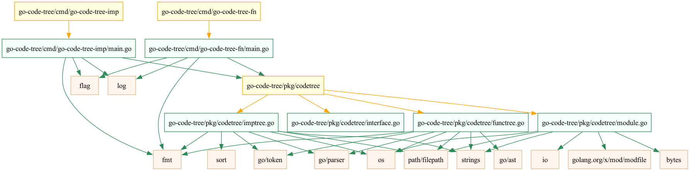
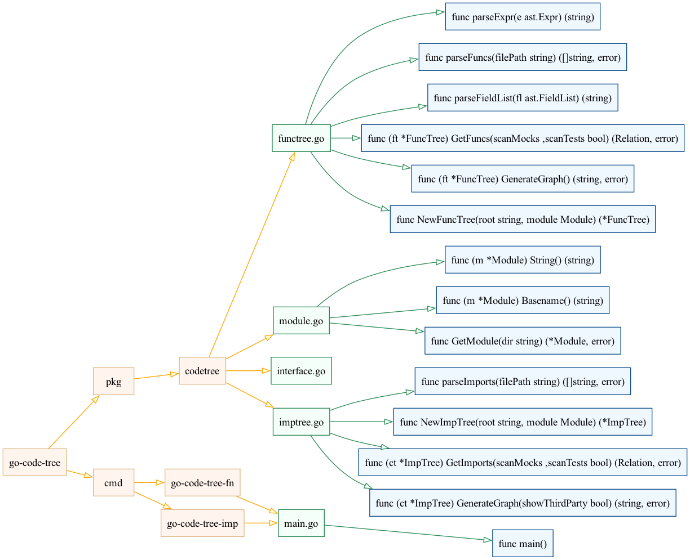

# `go-code-tree`

The goal of this project is to provide a visual overview of a Go project using a DOT diagram. Particularly, this tool only analyses directories and the files contained, then parses the imports of each go file and builds a map of imports (local and third party). By default it ignores third party imports, mock and test files.

## Usage

### `go-code-tree`

```
go-code-tree -h
Usage of go-code-tree:
  -dir string
        Directory of the Go project to scan for imports (default "./")
  -mocks
        Scan mock files
  -tests
        Scan test files
  -third
        Show third-party imports
```

#### Color references

* Third party dependencies have a light brown/subtle orange tint (burlywood and seashell), which is the default color for each node.
* Go code have a greenish tint (seagreen and mintcream)
* Dependencies/directories have a bright orange/yellow tint (orange and lightyellow)

Refer to the [Example](#example) for a clear picture.

### `go-code-tree-fn`

```
go-code-tree-fn -h
Usage of go-code-tree-fn:
  -dir string
        Directory of the Go project to scan code (default "./")
  -mocks
        Scan mock files
  -tests
        Scan test files
```
#### Color references

* Directories have a light bright orange/yellow tint (orange and lightyellow)
* Go code have a greenish tint (seagreen and mintcream)
* Functions (func, methods and constructors) have a blueish tint (dodgerblue4 and aliceblue)

Refer to the [Example](#example) for a clear picture.

## Build

### `go-code-tree`

```
go build -ldflags "-s -w" -o go-code-tree cmd/go-code-tree-imp/main.go
```

### `go-code-tree-fn`

```
go build -ldflags "-s -w" -o go-code-tree-fn cmd/go-code-tree-fn/main.go
```

## Example 

### `go-code-tree`

When running the script allowing third party dependencies (see [Suggested dependencies](#suggested-dependencies)): 
```
$ go-code-tree -dir go-code-tree -third | dot -Tpng -ogct.gv.png
```

It'll generate this diagram:




### `go-code-tree-fn`

When running the script with no args (see [Suggested dependencies](#suggested-dependencies)): 
```
$ go-code-tree-fn -dir go-code-tree | dot -Tpng -ogct.gv.png
```

It'll generate this diagram:



> Note: In this diagram, you'll see that `go-code-tree-imp` and `go-code-tree-fn` point to the same file, which might not seem ok but this is the default behavior in graphviz when creating diagrams with nodes with similar name.

## Suggested dependencies

* [Graphviz](https://graphviz.org/)

It's not required to have it installed to use this tool, because `go-code-tree{,-fn}` only prints diagrams, but it's useful to have `graphviz` installed to _see_ the diagram.

### macOS

```
brew install graphviz
```

### GNU/Linux (Debian based distros)

```
apt install graphviz
```

## LICENSE 

See [LICENSE](LICENSE)

## Related

* [go-callvis](https://github.com/ondrajz/go-callvis)
* [go-dep-graph](https://github.com/paetzke/go-dep-graph)